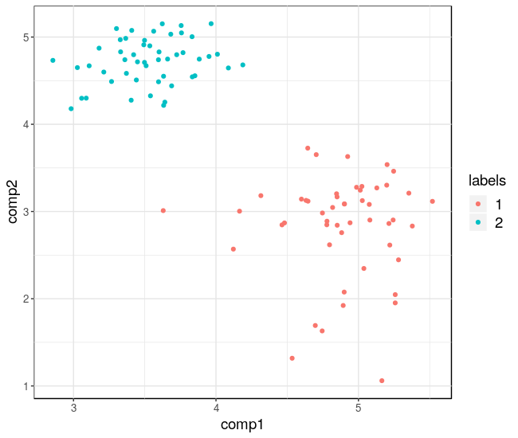
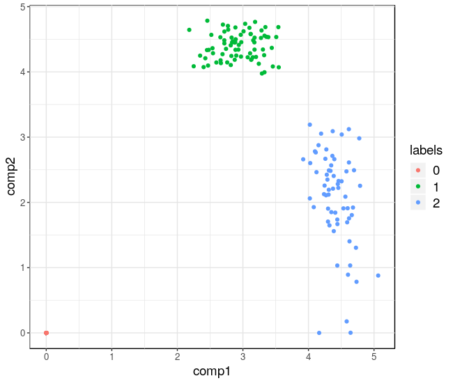
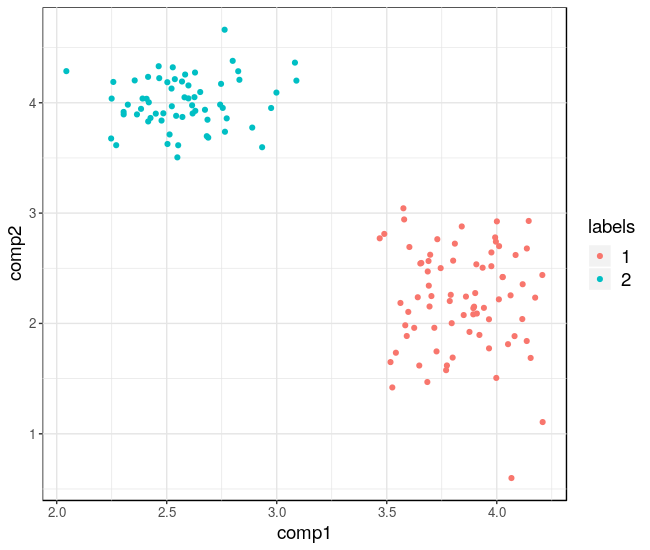

# R-package pCMF

Copyright 2019 Ghislain Durif. The pCMF package is available under the GPL-v2 license.

## Description

The pCMF package contains mplementation of the probabilistic Count 
Matrix Factorization (pCMF) method based on the Gamma-Poisson hirerarchical 
factor model with potential sparisty-inducing priors on factor V. This method
is specifically designed to analyze large count matrices with numerous 
potential drop-out events (also called zero-inflation) such as gene expression
profiles from single cells data (scRNA-seq) obtained by high throughput
sequencing.

In this framework, we consider a count data matrix $X$ with $n$ rows being 
individuals (e.g. cells in single-cell data) and $p$ columns being recorded
variables (e.g. gene expression in scRNA-seq data).

The pCMF approach uses matrix factorization to jointly construct a 
representation of individuals (cells) and variables (genes) in a low 
dimensional space, respectively the matrices $U$ of dimension $n \times K$ 
and $V$ of dimension $p \times K$ where $K$ is the dimension of this 
latent space. This representation can be used for data visualization 
(c.f. example below). Our method can also be used as a preliminary dimension 
reduction step before clustering.

## Details

In the probabilistic Count Matrix Factorization framework (pCMF), the count 
data matrix $X$ (of dimension $n \times p$) is approximated by a matrix 
product $U V^t$ where $U_{n\times K}$ and $V_{p\times K}$ respectively 
represent the individuals (rows of $X$) and variables (columns of $X$)
in a sub-space of dimension $K$.

In the pCMF framework, the approximation between $X$ and $U V^t$ is made 
regarding the Bregman divergence (generalization of Euclidean distance to 
non-Gaussian data) derived from the model $X \sim P(U V^t)$, i.e. each 
entry $X_{ij}$ is assumed to follow a Poisson distribution of 
parameter $\sum_k U_{ik} V_{jk}$. In addition, we consider a hierarchical 
model with Gamma prior distributions on factors $U$ and $V$. Our probabilistic 
model is able to account for zero-inflation (potential drop-out events) in 
the data matrix $X$ and/or for sparsity in the factor matrix $V$.

More details regarding pCMF can be found in Durif et al. (2019).

## Reference

Durif, G., Modolo, L., Mold, J.E., Lambert-Lacroix, S., Picard, F., 2019. 
Probabilistic Count Matrix Factorization for Single Cell Expression Data 
Analysis. arXiv:1710.11028 [stat].

All codes used to run experiments on pCMF in the paper are 
available at <https://github.com/gdurif/pCMF_experiments>.


---

## Instruction for users

### Installation

You can install the `pCMF` R package with the following R command:
```R
devtools::install_git("https://gitlab.inria.fr/gdurif/pCMF", subdir="pkg", ref="prod")
```

If you don't have OpenMP installed on your machine (for instance on MacOS), you can run the following command:
```R
devtools::install_git("https://gitlab.inria.fr/gdurif/pCMF", subdir="pkg", ref="prod_no_omp")
```
**Note:** We encourage you to install a compiler (e.g. gcc) that supports OpenMP in order 
to benefit from multi-core computing and improve computation performance.

To install the `devtools` package, you can run:
```R
install.packages("devtools")
```

You can also use the git repository available at <https://github.com/gdurif/pCMF.git>, 
then build and install the package with Rstudio (the [project file](./pCMF.Rproj) 
is set accordingly) or with the R command line tools.

To clone the repository, you can do:
```bash
git clone https://github.com/gdurif/pCMF.git
```
**Note:** if you don't have OpenMP on your system (c.f. previously), after cloning
the repository, you should do:
```bash
cd pCMF
git fetch origin prod_no_omp
git checkout prod_no_omp
```

Once you cloned the git repository, you can run to install the `pCMF` package:
```R
devtools::install("/path/to/pCMF/pkg") # you should edit the path
```

### Example of use

* Import the library
```R
library(pCMF)
```

* **Data:** You can also use your own data, it should be a matrix of integer count 
  values with individuals (cells) in row and variables (gene 
  expression) in columns.

* **Simulations** of data based on the generative model associated to our 
  approach. See Durif et al. (2017, Appendix) for more details about our 
  data generation process. Here, we generate 3 groups of individuals 
  (structured by $U$), 2 groups of genes with 40% of noisy genes 
  (structured by $V$). We add a level of 50% of drop-out events in the data.

```R
## generate data
set.seed(250)
n <- 100
p <- 500
K <- 20
factorU <- generate_factor_matrix(n, K, ngroup=2,
                                  average_signal=120,
                                  group_separation=0.8,
                                  distribution="exponential",
                                  shuffle_feature=TRUE)
factorV <- generate_factor_matrix(p, K, ngroup=2, average_signal=120,
                                  group_separation=0.8,
                                  distribution="exponential",
                                  shuffle_feature=TRUE,
                                  prop_noise_feature=0.6)
U <- factorU$factor_matrix
V <- factorV$factor_matrix
count_data <- generate_count_matrix(n, p, K, U, V,
                                    ZI=TRUE, prob1=rep(0.4,p))
X <- count_data$X
## or use your own data as a count matrix
## of dimension cells x genes (individuals x features)
```

* Heatmap of the count data matrix:
```R
matrix_heatmap(X)
```

* Pre-filtering of the variables (genes)
```R
kept_cols <- prefilter(X, prop = 0.05, quant_max = 0.95, 
                       presel = TRUE, threshold = 0.2)
```

To save computation time, you can use the variance-based heuristic for 
variable/gene pre-selection:
```R
kept_cols <- prefilter(X, prop = 0.05, quant_max = 0.95,
                       presel = TRUE, threshold = 0.2)
```

Remove variables that were filtered out:
```R
X <- X[,kept_cols]
```

* Apply the pCMF approach on the data with $K=2$
```R
## run pCMF algorithm
res1 <- pCMF(X, K=2, verbose=FALSE, zero_inflation = TRUE, 
             sparsity = TRUE, ncores=8) # edit nb of cores
```

* Check which variables (genes) contribute to the low-dimensional 
  representation (non-null entries in $V$), and re-apply the method with this 
  genes:
```R
## estimated probabilities
matrix_heatmap(res1$sparse_param$prob_S)
## corresponding indicator (prob_S > threshold, where threshold = 0.5)
matrix_heatmap(res1$sparse_param$S)
## rerun with genes that contributes
res2 <- pCMF(X[,res1$sparse_param$prior_prob_S>0],
             K=2, verbose=FALSE, zero_inflation = TRUE, 
             sparsity = FALSE, ncores=8)
```

* Get estimated factor matrices: $\hat{U}$ and $\hat{V}$ can be used for 
  clustering of individuals (cells) or variables (genes):
```R
hatU <- getU(res2)
hatV <- getV(res2)
```

* **Data visualization**:

  1. Individuals (cells):
```R
## individual representation 
graphU(res2, axes=c(1,2), labels=factorU$feature_label)
```



  2. Variables (genes), sparse representation:
```R
## variable representation (0 are noise variables)
graphV(res1, axes=c(1,2), 
       labels=factorV$feature_label)
```



  3. Variables (genes), representation after gene selection:
```R
## variable representation (0 are noise variables)
graphV(res2, axes=c(1,2), 
       labels=factorV$feature_label[kept_cols][res1$sparse_param$prior_prob_S>0])
```




---

## Instructions for developpers

### Development mode

(For Unix users: GNU/Linux or MacOS)

To enable C++ unit tests (based on the `Catch` library included in the 
`testthat` R package) and additional verbosity, you can edit the 
[Makevars](./pkg/src/Makevars) by adding the following compilation flag `-D_DEV`
before installing `pCMF`, i.e. replace the first line of the file with:

```
PKG_CXXFLAGS = $(SHLIB_OPENMP_CXXFLAGS) -I../src/utils -D_DEV
```

### Construction of the package

The C++ sources of the `pCMF` package are organised as follows:

* Templates of models for matrix factorization are defined in the 
  [model.h](./pkg/src/model.h) file.
  
* Inheriting from the classes defined in the previous files, Poisson NMF model
  is defined in the [poisson_nmf.h](./pkg/src/poisson_nmf.h) files, and the 
  various Gamma-Poisson factor model defining pCMF are defined in the 
  [gap_factor_model.h](./pkg/src/gap_factor_model.h), 
  [zi_gap_factor_model.h](./pkg/src/zi_gap_factor_model.h),
  [sparse_gap_factor_model.h](./pkg/src/sparse_gap_factor_model.h) and
  [zi_sparse_gap_factor_model.h](./pkg/src/zi_sparse_gap_factor_model.h) files,
  depending on which features, being sparsity on the matrix `V` or 
  zero-inflation (ZI) in the count data matrix, that you want to consider.
  These files describe update rules for iterative optimization algorithms and 
  computation formulas (for criterion such as deviance, ELBO) that will be used 
  to control the iterative process.
  
* Optimization algorithms are templated in the 
  [algorithm.h](./pkg/src/algorithm.h) file. Then simple iterative algorithm 
  and variational EM algorithm are respectively defined in the 
  [algorithm_simple_factor.h](./pkg/src/algorithm_simple_factor.h) and 
  [algorithm_variational_EM.h](./pkg/src/algorithm_variational_EM) files.
  
* Wrapper for functions (that will be exposed to R) are templated in the 
  [wrapper_matrix_factor.h](./pkg/src/wrapper_matrix_factor.h),
  [wrapper_gap_factor.h](./pkg/src/wrapper_gap_factor.h) and
  [wrapper_sparse_gap_factor.h](./pkg/src/wrapper_sparse_gap_factor.h) files.

* Wrapper functions that are actually exported and callable from R are defined 
  in the [run_gap_factor.h](./pkg/src/run_gap_factor.h),
  [run_zi_gap_factor.h](./pkg/src/run_zi_gap_factor.h),
  [run_sparse_gap_factor.h](./pkg/src/run_sparse_gap_factor.h),
  [run_zi_sparse_gap_factor.h](./pkg/src/run_zi_sparse_gap_factor.h) and 
  [run_poisson_nmf.h](./pkg/src/run_poisson_nmf.h) files, respectively for 
  standard Gamma-Poisson factor model, Gamma-Poisson factor model with 
  zero-inflation, Gamma-Poisson factor model with sparsity, Gamma-Poisson 
  factor model with zero-inflation and sparsity, Poisson NMF.

* All C++ unit tests are defined in `./pkg/src/test_XXX.cpp` files where `XXX` 
  is self-explanotory.
  
* The subdirectory [utils](./pkg/src/utils) contains files defining utility 
  functions (for computation over matrices, computation of likelihood, etc.).


